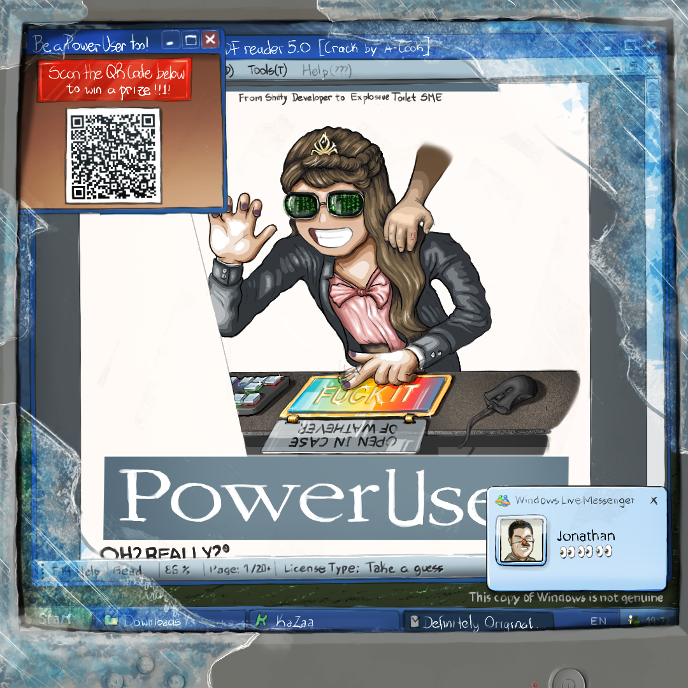

> ⚠️ **This is meant to be funny**: Don't take this too serious. Although... you do you.

    

 

  
  <h3 align="center">The Fuck It Button</h3>

    A problem-solving tool like no other
     
    <a href="https://docs.google.com/document/d/1nhoM91mAQjcdlVoDwfj2UoEHs_M3Dp_ldV_9QW5PEtY/edit?usp=sharing"><strong>Explore the docs »</strong></a>
     
     
    <a href="https://htmlpreview.github.io/?https://github.com/ArturCook/in_case_of_trouble/blob/main/in_case_of_trouble.html#">Link in Production</a>
    ·
    <a href="https://github.com/ArturCook/in_case_of_trouble/issues/new?labels=bug&template=bug-report---.md">Report Bug</a>
    ·
    <a href="https://github.com/ArturCook/in_case_of_trouble/issues/new?labels=enhancement&template=feature-request---.md">Request Feature</a>
  

<!-- TABLE OF CONTENTS -->

  
Table of Contents

  <ol>
    <li>
      <a href="#about-the-project">About The Project</a>
      <ul>
        <li><a href="#built-with">Built With</a></li>
      </ul>
    </li>
    <li>
      <a href="#getting-started">Getting Started</a>
      <ul>
        <li><a href="#prerequisites">Prerequisites</a></li>
        <li><a href="#installation">Installation</a></li>
      </ul>
    </li>
    <li><a href="#usage">Usage</a></li>
    <li><a href="#testimonials">Testimonials</a></li>
    <li><a href="#roadmap">Roadmap</a></li>
    <li><a href="#contributing">Contributing</a></li>
    <li><a href="#license">License</a></li>
  </ol>

<!-- ABOUT THE PROJECT -->

## About The Project

This was a decision-making tool I built for a friend back in 2022. It was originally an HTML file I sent via Telegram. Later I updated it and put it on Github, only so I can host it online and to send people the link. I added support for English just because. Other people suggested I add other languages. I said *"lol, sure"*.

The [image in here](https://www.instagram.com/p/C2YgjPgBgo2/) was commissioned by me, for me to use in this project, made using an iPad, by none other than myself. More context of how it came to be can be found [in here](https://docs.google.com/document/d/1Al7hrkhiELTRLPRLHGMo1rjseLiTEp-_K51fdxT3oI4/edit#heading=h.v8ped9sw6luu), under the **PowerUser** section. The link will take you directly there.

It then became a [full text](https://docs.google.com/document/d/1nhoM91mAQjcdlVoDwfj2UoEHs_M3Dp_ldV_9QW5PEtY/edit) on principles of software development. Same idea. Meant to be funny, but has some truth to it. Written also by me. It's also distributed under MIT License.

Don't forget to give the project a star! I'm not too sure what that means. I don't use Github that much. But I'm sure it must be a good thing. Thanks again!

(<a href="#readme-top">back to top</a>)

### Built With

* [![html][html-img]][html-url]
* [![css][css-img]][css-url]
* [![javascript][javascript-img]][javascript-url]
* That's pretty much it, I guess...

(<a href="#readme-top">back to top</a>)

<!-- GETTING STARTED -->

## Getting Started

### Prerequisites

None

### Installation

Click on [the link of the button](https://htmlpreview.github.io/?https://github.com/ArturCook/in_case_of_trouble/blob/main/in_case_of_trouble.html#)

<!-- USAGE -->

## Usage

Choose a language. Click The Button. Check if your problem got solved. If it did, it worked. If it didn't, press it again.

(<a href="#readme-top">back to top</a>)

<!-- Testimonials -->

## Testimonials

> *Very necessary sometimes.*

> *That's awesome, I sent it to all my friends!*

> *An oracle for our confusing times.*

> *FUCK IT, MATE
> HUAEUHAEHUUHAEUHEAHUAEHUAEHUAEUHUHAEHUAEHUAEHUUEHUHEUHAEUHAEUHAUHEUHAEUHAEUHAEUHAEHAE
> WONDERFUL*

> *What's the deal? It's just a button? That's it?*

(<a href="#readme-top">back to top</a>)

<!-- ROADMAP -->

## Roadmap

- [X] Add Support for iOS
- [X] Add README
- [ ] Refactor HTML and CSS into separate files
- [ ] Migrate to React or Vue.js or some other front-end framework?
  - [ ] Figure out what's the trendy at the moment
  - [ ] Do some googling on how to use it
  - [ ] Put it anywhere in the project
  - [ ] Add the badge to this README
- [ ] Multi-language Support
  - [X] French
  - [X] Korean
  - [X] Polish
  - [ ] Chinese
- [ ] Not sure what else...
  - [ ] ...
  - [ ] ...
  - [ ] Adding some blank spaces so I can fill in later...

See the [open issues](https://github.com/ArturCook/in_case_of_trouble/issues) for a full list of proposed features (and known issues).

(<a href="#readme-top">back to top</a>)

<!-- CONTRIBUTING -->

## Contributing

If you want to contribute to it, here's how to do it:

> 1. Fork the Project
> 2. Create your Feature Branch (`git checkout -b feature/AmazingFeature`)
> 3. ...
> 4. ... Honestly, it's not that complicated of a codebase. Just do a Pull Request in any way you want.

If you see an issue or bug or you have a suggestion to make it better, feel free to let me know. Or don't. Fuck it. It's up to you. In any case you're contributing, in your own way.

(<a href="#readme-top">back to top</a>)

<!-- LICENSE -->

## License

Distributed under the MIT License. See `LICENSE.txt` for more information.

(<a href="#readme-top">back to top</a>)

<!-- MARKDOWN LINKS & IMAGES -->

<!-- Badges made in shield.io using this tutorial: https://javascript.plainenglish.io/how-to-make-custom-language-badges-for-your-profile-using-shields-io-d2aeaf016b6b -->

[html-img]: https://img.shields.io/badge/-HTML-E34F26?logo=html5&logoColor=white&style=flat-square
[html-url]: https://en.wikipedia.org/wiki/HTML
[css-img]: https://img.shields.io/badge/-CSS-1572B6?logo=css3&logoColor=white&style=flat-square
[css-url]: https://en.wikipedia.org/wiki/CSS
[javascript-img]: https://shields.io/badge/JavaScript-F7DF1E?logo=JavaScript&logoColor=000&style=flat-square
[javascript-url]: https://en.wikipedia.org/wiki/JavaScript
